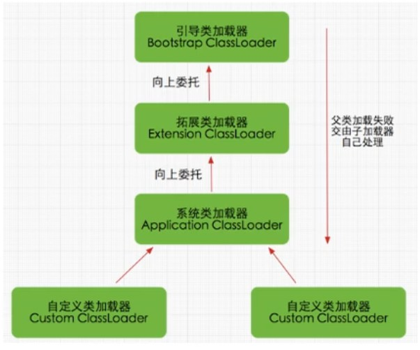

- JVM 对 class 文件采取 `按需加载` 的方式，即要用到该类时才会去加载它的 class 文件到内存中生成 class 对象；
并且在加载某个类的 class 文件时，JVM 采用 `双亲委派模式`—— 一种任务委派模式，把请求交由父类处理。

## 1、工作原理

    1）若一个类加载器收到了类加载请求，它并不会自己去加载，而是把这个请求委托给父类加载器去执行；
    2）若父类加载器还有父类加载器，则依次往上委托，依次递归，请求最终的顶层的启动类加载器；
    3）若父类加载器可以完成加载任务，则返回；若父类加载器无法完成加载任务，此时子加载器才会尝试自己去加载。
- 以上就是双亲委派模式的工作原理。图例如下：

