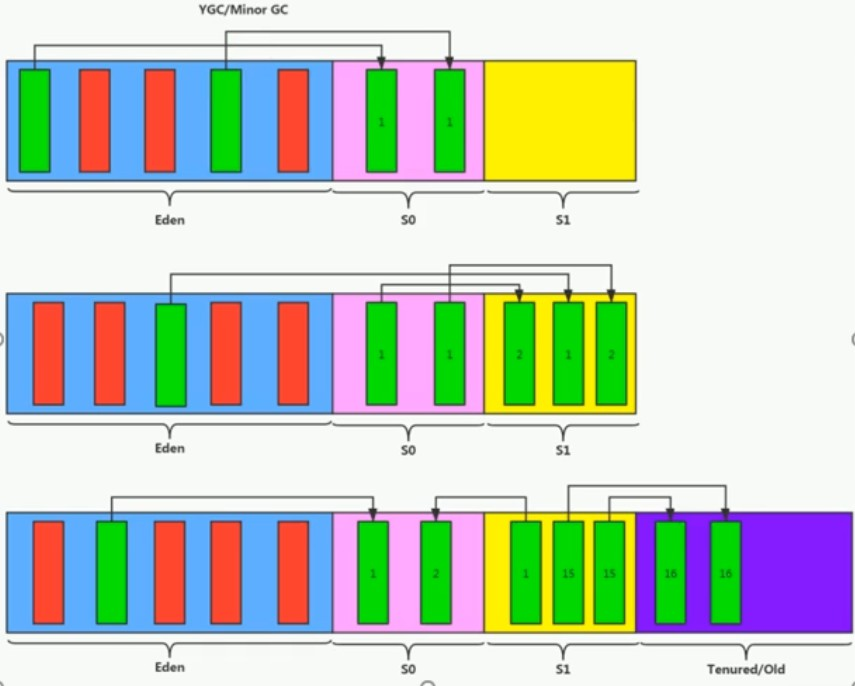
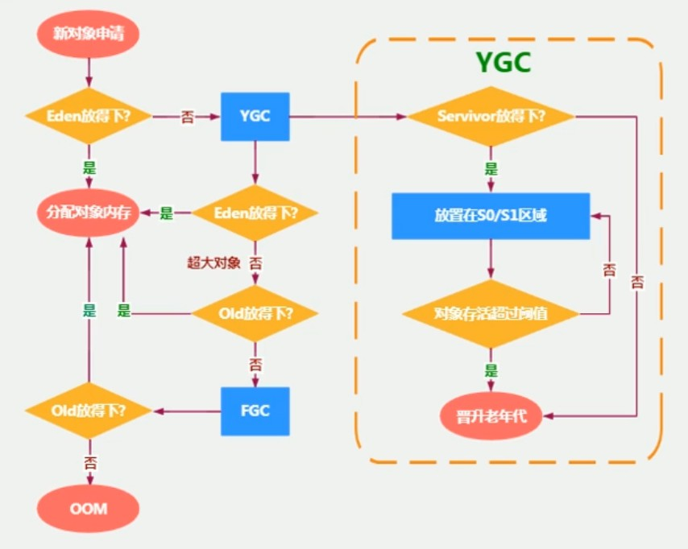
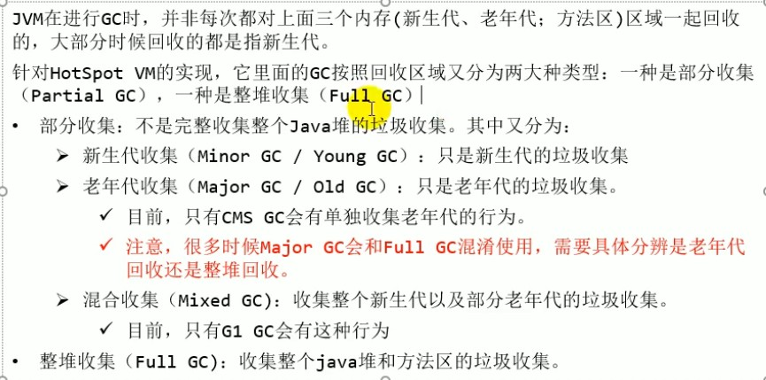
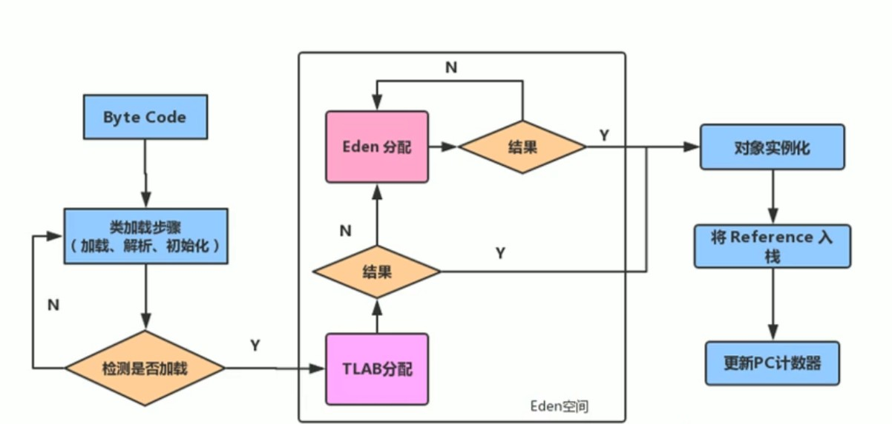
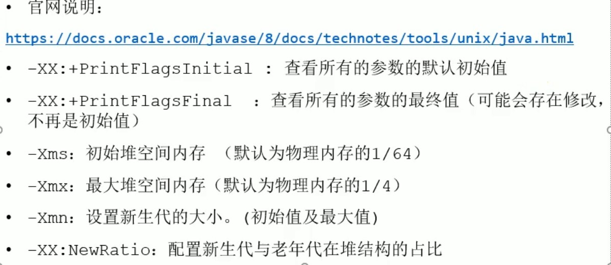
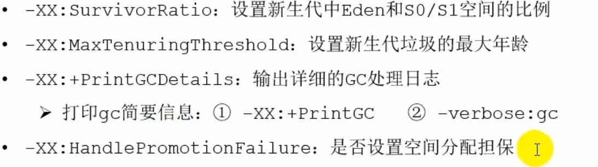
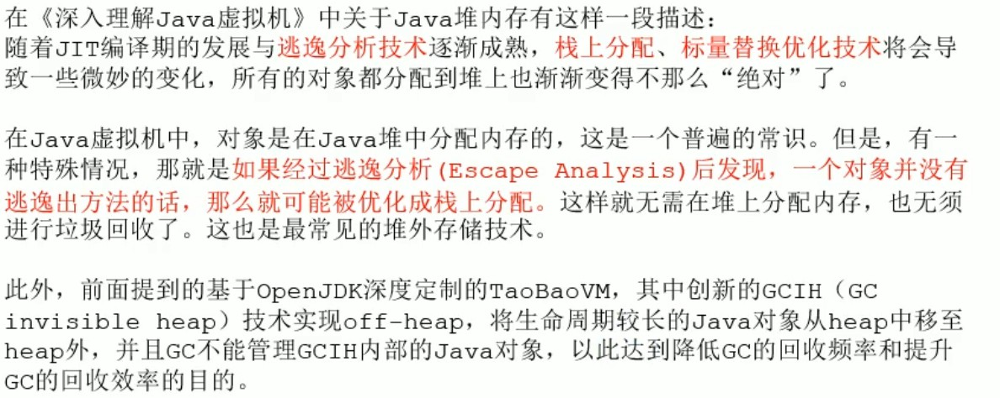

# 堆

## 1、堆的核心概述

- 一个JVM实例只存在一个堆内存，堆是Java内存管理的核心区域。Java堆随JVM的启动而创建，所有线程共享Java堆，同时也只支持划分线程私有的缓冲区（Thread Local Allocation Buffer，TLAB）
- 所有的对象实例和数组都应当在运行时分配在堆上，方法结束后堆中的对象不会被马上移除，仅仅在垃圾收集时才会被移除。
- JDK1.8 之后，基于分代收集理论，堆内存逻辑上分为三部分：新生区、养老区和元空间；其中新生区又分为伊甸园区和幸存者区，幸存者区分为零区和一区（from区和to区）。JVM在存放数据是，伊甸园区和幸存者区是二选一的，不是同时都存放的

    

## 2、设置堆内存大小与OOM

- 使用以下 JVM 的启动参数可以设置堆的大小：

    1）-Xms：表示堆区的其实内存，等价于-XX:InitialHeapSize

    2）-Xmx：表示堆区的最大内存，等价于-XX:MaxHeapSize

- 以上参数设置的内存空间大小是年轻代和老年代的大小。
- 一旦堆区中的内存大小超过Xmx所设置的，将抛出OOM异常，默认初始堆内存为物理内存的六十四分之一，最大内存为物理内存的四分之一。

## 3、年轻代与老年代

- 存储在JVM中的Java对象可以被划分为两类：生命周期较短的，此类对象的创建和消亡都非常迅速；另一类生命周期比较长，在某些极端情况下还能够与JVM的生命周期保持一致。
- 消亡快的就存放在新生代，存在时间长的就存放在老年代。
- 可用如下参数配置新生代和老年代在堆栈结构中的占比：

    1）默认 -XX:NewRation=2，表示新生代占1，老年代占2，新生代占整个堆的三分之一。

    2）-XX:NewRation=4，表示新生代占1，老年代占4，新生代占整个堆的五分之一。
- 默认情况下，HotSpot JVM 中伊甸园区和两个幸存者区占比为8:1:1，允许开发人员通过参数指令 -XX:SurvivorRation=8,进行设置。但由于JVM有内存自适应策略，伊甸园区和两个幸存者区的比例并非是默认比例，要真正按照默认比例可以用参数显式设置。
- 几乎所有对象都是在伊甸园区被创建出来，在新生代区消亡，可以用 -Xmn 设置新生代最大内存
## 4、对象分配过程

- 新创建的对象首先会被分配到伊甸园区，当伊甸园区填满便会触发JVM GC（YGC Minor GC）进行垃圾回收，将不再被其他对象引用的对象销毁，GC 之后剩余的对象会被移动到幸存者0区，然后将新创建的对象放到伊甸园区；当GC机制再次被触发，若幸存者0区的对象还有没被回收的，就会被移动到幸存者1区，再次触发GC机制这些对象又会回到幸存者0区，总之反复在幸存者区的两个区中来回移动，直到当移动次数达到一个阈值，将会被移动到养老区，这个阈值默认是15次，也可以通过：-XX:MaxTenuringThreshold=(n)进行设置。当养老区内存不足时，会触发Major GC，进行养老区的清理，若养老区执行了Major GC 之后，依然存在无法进行对象的保存，就会产生OOM异常。
- 对象从伊甸园区移动到幸存者区时，是移动到为空的那个区。因此，空的称为to区，非空的为from区

    
- 流程图：
  

## 5、Minor GC、Major GC、Full GC

- 调优主要就是减少GC的次数，尤其是Major GC 和 Full GC 的次数，因为 GC 线程会停止用户线程的执行。

    

## 6、堆空间分代思想

- 堆空间进行对象分代，是为了优化GC的性能，能够将临时对象及时进行回收从而释放内存空间，而对于生命周期比较长的放在一块，减少对他们进行GC判断，简短GC的总时间.

## 7、内存分配策略

- 参考对象分配过程。
- 针对不同年龄段的对象分配原则如下：

    1）优先分配到伊甸园区

    2）大对象直接分配到老年代，因此程序中应当尽量避免出现过多的大对象

    3）长期活动的对象分配老年代

    4）动态对象年龄判断：如果幸存者区中相同年龄的所有对象大小的总和大于幸存者区空间的一般，年龄大于或等于该年龄的对象可以直接进入老年代，无需达到在两个幸存者区的移动次数阈值后才进行。

    5）空间分配担保，即老年代担保有足够的空间放下幸存者区和伊甸园区放不下的对象。

## 8、为对象分配内存：TLAB

- TLAB，即 Thread Local Allocation Buffer。由于堆区是共享区域，并且由于对象实例在JVM中的创建非常频繁，在并发环境下从堆区中划分内存空间是线程不安全的，为避免多个线程操作同一个地址，需要使用加锁机制，可是加锁会导致分配速度变慢，因此出现了在堆空间中为每个线程分配私有的缓存区，主要在伊甸园区中进行此操作，从而提高分配效率，此种方式称为 `快速分配策略`。
- 但是TLAB空间很小，仅占整个伊甸园区的1%，可以使用 -XX:UseTLAB 指令参数开启TLAB空间，用 -XX:TLABWasteTargetPrecent 设置 TLAB 空间所占用伊甸园区的百分比。通常是默认开启TLAB空间的。
- 当开启了 TLAB后，对象若在TLAB分配失败，JVM就会尝试通过使用加锁机制从伊甸园区中的其他内存区进行对象空间分配。

    

## 9、小结堆空间的参数设置

- 堆空间常用的调优参数，如下：

    

    

- 打印 GC 的简要信息用：-XX:PrintGC, verbose:gc

## 10、堆是分配对象的唯一选择吗
- 见下图：

    

- 通过逃逸分析，Java HotSpot VM 编译器能够分析出一个对象的引用范围从而决定是否要将该对象分配到堆上；逃逸分析的基本行为就是分析对象的动态作用域：

    1）当一个对象在方法中被定义后，对象只在方法内部使用，则认为没有发生逃逸。

    2）当一个对象在方法中被定义后，它被外部方法所引用，则认为发生逃逸，如作为调用参数传递到其他地方。
- 使用逃逸分析，编译器可以对代码做以下优化：

    1）栈上分配：将堆分配转为栈分配，如果一个对象在子程序中被分配，要使指向该对象的指针永远不会逃逸，对象可能是栈分配的候选，而不是对分配。

    2）同步省略：若一个对象被发现只能从一个线程被访问到，那么对于这个对象的操作可以不考虑同步。

    3）分离对象或标量替换：有的对象可能不需要作为一个连续的内存结构存在也可以被访问到，那么对象的部分或全部可以存储在内存，而是存储在CPU寄存器。
- 因此，在实际开发中能使用局部变量的，就不要在方法外定义。