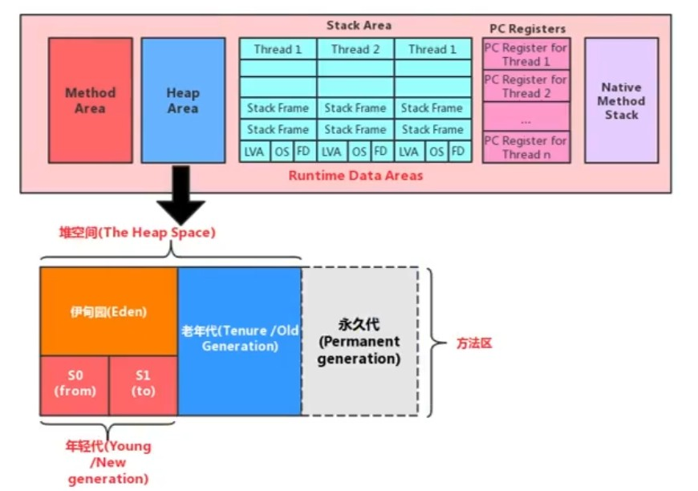

# 堆

## 1、堆的核心概述

- 一个JVM实例只存在一个堆内存，堆是Java内存管理的核心区域。Java堆随JVM的启动而创建，所有线程共享Java堆，同时也只支持划分线程私有的缓冲区（Thread Local Allocation Buffer，TLAB）
- 所有的对象实例和数组都应当在运行时分配在堆上，方法结束后堆中的对象不会被马上移除，仅仅在垃圾收集时才会被移除。
- JDK1.8 之后，基于分代收集理论，堆内存逻辑上分为三部分：新生区、养老区和元空间；其中新生区又分为伊甸园区和幸存者区，幸存者区分为零区和一区（from区和to区）。JVM在存放数据是，伊甸园区和幸存者区是二选一的，不是同时都存放的

    

## 2、设置堆内存大小与OOM

- 使用以下 JVM 的启动参数可以设置堆的大小：

    1）-Xms：表示堆区的其实内存，等价于-XX:InitialHeapSize

    2）-Xmx：表示堆区的最大内存，等价于-XX:MaxHeapSize

- 以上参数设置的内存空间大小是年轻代和老年代的大小。
- 一旦堆区中的内存大小超过Xmx所设置的，将抛出OOM异常，默认初始堆内存为物理内存的六十四分之一，最大内存为物理内存的四分之一。

## 3、年轻代与老年代

- 存储在JVM中的Java对象可以被划分为两类：生命周期较短的，此类对象的创建和消亡都非常迅速；另一类生命周期比较长，在某些极端情况下还能够与JVM的生命周期保持一致。
- 消亡快的就存放在新生代，存在时间长的就存放在老年代。
- 可用如下参数配置新生代和老年代在堆栈结构中的占比：

    1）默认 -XX:NewRation=2，表示新生代占1，老年代占2，新生代占整个堆的三分之一。

    2）-XX:NewRation=4，表示新生代占1，老年代占4，新生代占整个堆的五分之一。
- 默认情况下，HotSpot JVM 中伊甸园区和两个幸存者区占比为8:1:1，允许开发人员通过参数指令 -XX:SurvivorRation=8,进行设置。但由于JVM有内存自适应策略，伊甸园区和两个幸存者区的比例并非是默认比例，要真正按照默认比例可以用参数显式设置。
- 几乎所有对象都是在伊甸园区被创建出来，在新生代区消亡，可以用 -Xmn 设置新生代最大内存
## 4、图解对象分配过程

## 5、Minor GC、Major GC、Full GC

## 6、堆空间分代思想

## 7、内存分配策略

## 8、为对象分配内存：TLAB

## 9、小结堆空间的参数设置

## 10、堆是分配对象的唯一选择吗