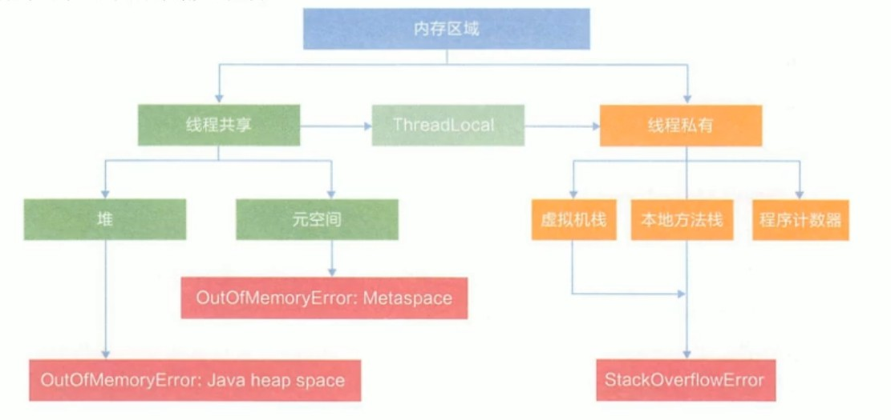
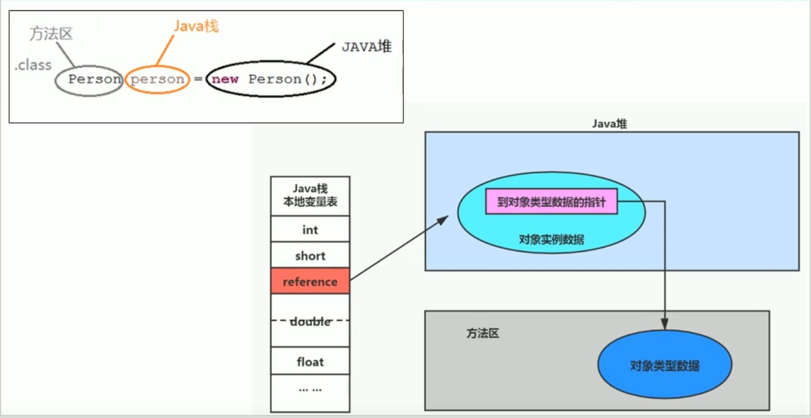
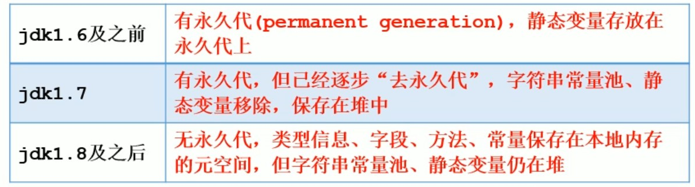

# 方法区

## 1、栈、堆与方法区之间的交互关系

- 栈、堆和方法区三者之间的关系，可以使用下面的流程图来理解：

    
- 图上的元空间即方法区

    
-

## 2、方法区的理解

- 方法区看作是一块独立于 Java 堆的内存空间，方法区和堆一样也是线程共享的，随JVM启动而创建，大小可以固定也可以动态扩展，同样存在GC和OOM，当JVM关闭，该方法区就会被操作系统释放。当加载大量的第三方的Jar包时，出现类信息加载太多，方法区就有可能出现OOM异常。

## 3、设置方法区大小与OOM

- JDK7以及以前使用如下参数设置方法区大小：

    1）-XX:PermSize：设置永久代的初始分配空间，默认值为20.75M

    2）-XX:MaxPermSize:设置永久代最大可分配空间，32位机器默认是64M，64位默认时82M。
- JDK8以及之后的版本，使用下面的参数进行设置：

    1）-XX:MetaspaceSize：设置元空间初始大小，默认值约为21M

    2）-XX:MaxMetaspceSize:设置元空间最大可分配空间，默认值为-1，即没有限制。

## 4、方法区的内部结构

- 方法区中存储已被虚拟机加载的类型信息、常量、静态常量、即时编译器编译后的代码缓存等。
- 对每个加载的类型（Class、interface、enum、annotation），JVM必须在方法区中存储一下类型信息：

    1）这个类型的完整有效名称，即由包路径和类名构成的类的全限定名

    2）这个类型的直接父类的完整有效名（interface或java.lang.Object除外，此二者都没有父类）

    3）这类型的修饰符

    4）这个类型直接接口的一个有序列表
- 域（Field）信息：JVM 必须在方法区中保存类型的所有域的相关信息和域的声明顺序；域的相关信息包括：域名称、域类型、域修饰符（public、private、protected、static、final、volatile、transient的某个子集）
- JVM 必须保存所有方法的名称、返回类型、参数信息（数量和类型，按顺序）、方法的修饰符、操作数栈、局部变量表及大小和异常表。

### 4.1、运行时常量池

- 运行中的常量池信息称为运行时常量池。运行时常量池中包含多种不同的常量，包括编译期就已经明确的数值字面量，也包括到运行期解析后才能够获得的方法或者字段引用。运行时常量池相对于字节码文件中的常量池表，具有动态性。当创建类或接口的运行时常量池时，如果构造运行时常量池所需的内存空间超过了方法区所能提供的最大值，就会发生OOM错误。

## 5、方法区使用举例

- 见 MethodAreaDemo。

## 6、方法区的演进细节

- JDK7以及以前，习惯上将方法区称为永久代，JDK8以及之后改称元空间，今后也是称元空间。

    
- 使用元空间替代永久代的原因在于永久代的空间大小很难确定，并且也比较容易产生OOM错误，而元空间使用本地内存，默认情况下元空间大小仅受bending内存限制；另外，对永久代进行调优很困难。
- String Table 要移动到堆空间的原因在于，永久代的回收效率很低，在 full GC 的时候才会触发，而实际代码编写中，会有大量的字符串被创建，如果 String Table 回收率低下，容易导致永久代内存不足，移动到堆中就可以及时进行内存回收。
- 静态引用对应的对象实体始终都存储在堆空间中.
- JDK7以及之后，JVM 选择将静态变量与类型在 Java 语言一端的映射Class对象存放在一起，存储于Java堆中。

## 6、方法区的垃圾回收

- 方法区的回收效果比较难令人满意，尤其是类型的卸载，条件相当苛刻；但方法区的回收有时确实是必要的。方法区的垃圾收集主要回收常量池中废弃的常量和不再使用的类型。HotSpot JVM 对常量池的回收策略是只要常量池中的常量没有被任何地方引用，就可以被回收。一个类必须满足以下条件才可以被断定为“不再使用”：

    1）该类的所有实例都已经被回收，并且其子类的实例都不存在

    2）加载该类的加载器已经被回收，这个条件除非是经过精心设计的可替换类加载器的场景，如 OSGI、JSP 的加载等，否则都很难达成。

    3）该类对应的 java.lang.Class 对象没有任何地方被引用，无法在任何地方通过反射访问该类的方法。

