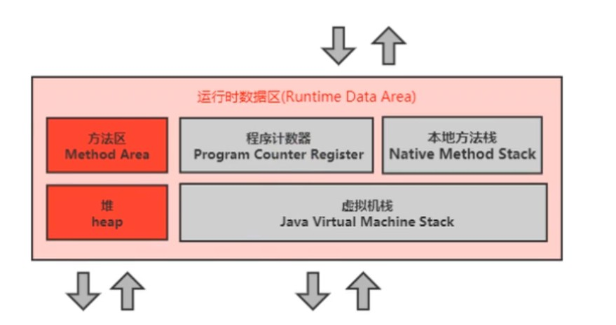
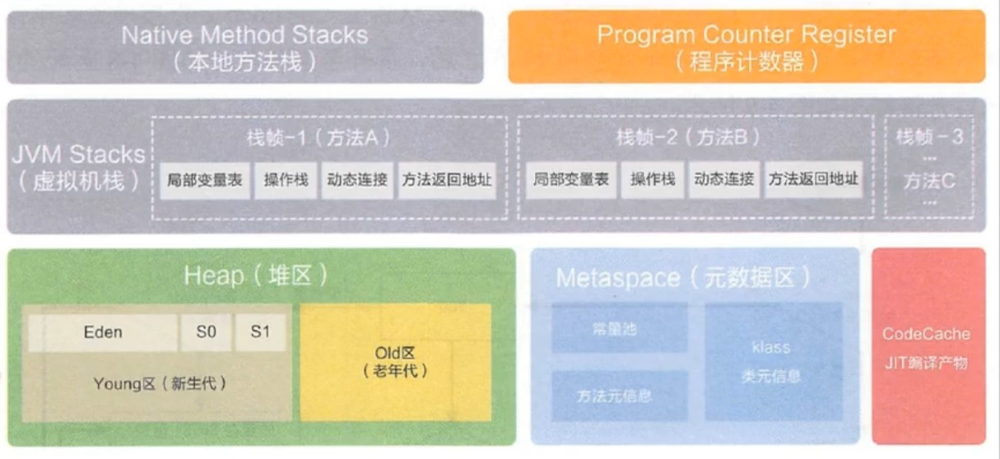
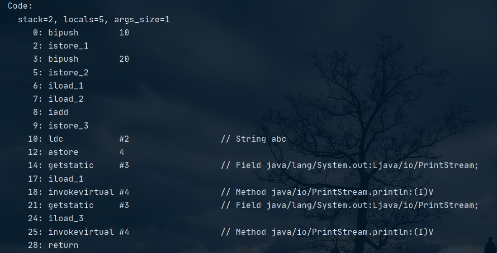
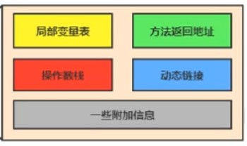
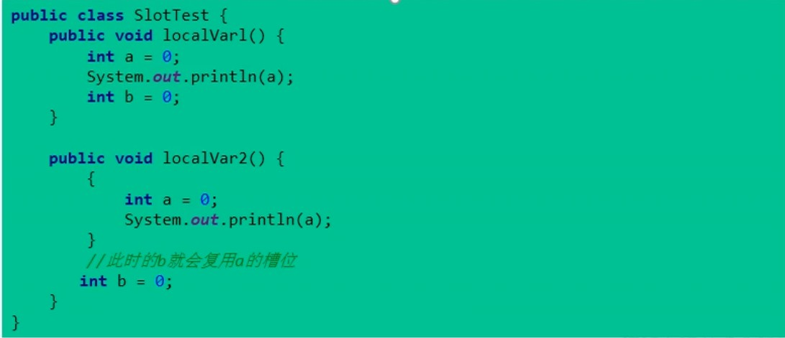
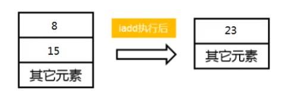
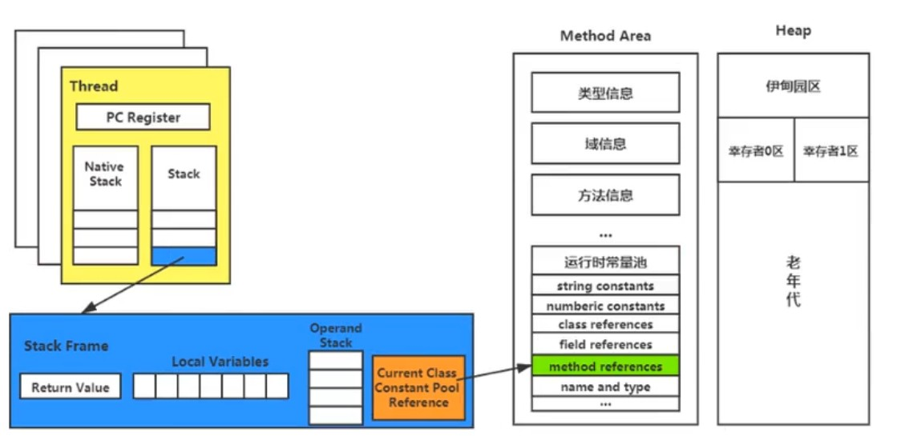
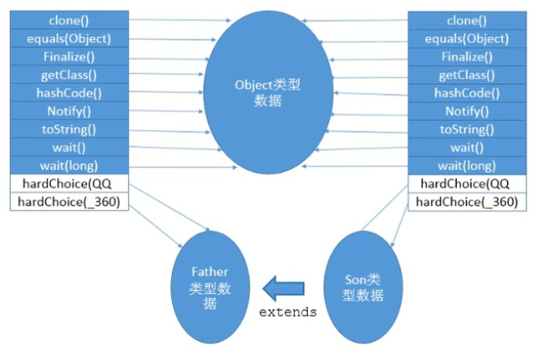
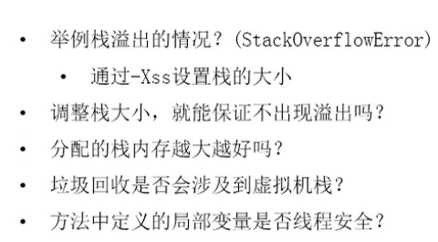

- 运行时数据区由 `方法区、堆、程序计数器、本地方法栈和虚拟机栈`几大部分构成。

# 一、概述

## 1、JVM 内存布局

- 经典的 JVM 内存布局如下图：

    

- 向上与类加载器子系统交互，向下与执行引擎和交互，并向下提供本地方法接口和本地方法库。JVM 内存具体划分如下图：

    

- JVM 定义了若干程序运行期间会使用到的运行时数据区，其中有一些会随虚拟机的启动而创建，并随着虚拟机的退出而销毁；而另外一些则与线程一一对应，它们会随着线程的开始和结束而创建和销毁。
- 其中方法区和堆空间中的数据是共享的，多个线程之间可以相互访问；而PC计数器、本地方法栈和虚拟机栈中的数据都是非共享的、线程独占一份。因此，垃圾回收或者说JVM调优都是针对方法区和堆进行的。
- 每个 JVM 实例只有一个 Runtime 实例

## 2、Java 线程

- Hotspot JVM 中，每个线程都与操作系统的本地线程直接映射：当一个 Java 线程准备就绪执行后，操作系统同时创建一个对应的本地线程；当 Java 线程执行完成和终止，操作系统就会将对应的本地线程回收。
- 操作系统负责所有线程的安排调度到CPU中，一旦本地线程初始化成功，它就会调用Java线程中的run()方法。
- JVM 线程分为 `守护线程和普通线程`， 当一个 JVM 实例（进程）只要还有普通线程在执行，那么操作系统就不会回收 JVM 实例；而如果只剩下守护线程，则操作系统会将 JVM 实例终止。具体分类，则 Hotspot JVM 里的守护线程——后台线程（不包括public static void main(String[])线程）主要分为：

    1）虚拟机线程：当 JVM 达到安全点才生成。这些操作必须在不同的线程中发生的原因，是它们都需要 JVM 达到安全点，这样堆才不会变化。这种线程的执行类型包括“stop-the-world”的垃圾收集、线程栈收集、线程挂起和偏向锁撤销。

    2）周期任务线程：时间周期事件的体现，一般用于周期性的调度执行。

    3）GC 线程：对在 JVM 里不同种类的垃圾收集行为提供了支持。

    4）编译线程：在 java 程序运行时将字节码文件编译成本地代码。

    5）信号调度线程：接收信号并发送给 JVM，在它内部通过适当的方法进行处理。

# 二、PC 寄存器

- JVM 中的 PC 寄存器是对物理 PC 寄存器的一种抽象模拟。与物理 PC 寄存器一样，JVM 的 PC 寄存器也是用于存储下一条指令的地址；任何时刻只要线程中有一个方法在执行，即所谓的 `当前方法`，JVM PC 寄存器都会存储当前线程正在执行的方法的 JVM 指令地址；或者线程中在执行 native 方法，则 JVM PC 寄存器的值为未指定值（undefine)。
- PC 寄存器是程序流程控制所必须的，也是 Java 虚拟机规范中没有规定任何 `OutOtMemeryError` 情况的区域。

- 示例：

    

- 最左的数字即指令地址或偏移地址，之后是操作指令。
- 关于 JVM PC 寄存器的两个常见的面试问题：

    1）使用 PC 寄存器存储字节码指令地址有什么用？为什么使用 PC 寄存器记录当前线程的执行地址？
    
     因为 CPU 需要不停切换线程，返回时需要知道接着执行哪条指令，而 PC 寄存器的值明确指出下一条的指令地址。

    2）PC 寄存器为什么被设定为线程私有？

    避免线程执行步骤出错，

# 三、虚拟机栈

## 1、概述

- 虚拟机栈的出现，是由于 Java 指令是基于栈的，为了跨平台的需要。栈式运行时单位，堆是存储单位；即栈解决程序的运行问题，堆解决程序的存储问题。每个 Java线程都有一个虚拟机栈，其内部保存一个个栈帧，对应着一次次的 Java 方法调用，是线程私有的。主管线程的运行，保存方法的局部变量（8种基本数据类型变量、对象的引用地址）、部分结果，并参与方法的调用和返回。虚拟机栈只有进栈和出栈操作，无需垃圾回收处理，但存在溢出问题
- JVM 允许虚拟机栈的大小是动态或静态的，对于后者可能存在栈溢出（StackOverError），而前者由于无限扩展可能导致超出内存大小发生内存溢出（OutOfMemoryError）异常。
- 开发者通过使用参数 `-Xss` 选项可以设置最大栈空间，而栈空间决定了函数调用的最大可达深度；例如：-Xss256k。

## 2、栈帧

- 栈帧是虚拟机栈的存储单位；栈帧是一个内存区，是一个数据集，维系着方法执行过程中的各种数据信息。方法和栈帧是一一对应的，方法调用，则栈帧入栈，方法结束则栈帧出栈。在一个活动线程中，一个时间点只会有一个活动的栈帧、有效的栈帧，这个栈帧称之为 `当前栈帧`，其所映射的方法较 `当前方法`，当前方法所归属的类就是 `当前类`；执行引擎运行的所有字节码指令只针对当前栈帧进行操作。不同线程所包含的栈帧是不允许相互引用的。栈帧的退栈可由方法的正常返回以抛出异常触发。
- 代码示例，见 StackFrameTest 类。

### 2.1、栈帧内部结构

- 栈帧由局部变量表（Local Variables）和操作数栈（Operand Stack，表达式栈）、动态链接（Dynamic Linking，指向运行时常量池的方法引用）、方法返回地址（Return Address、方法正常退出或异常退出的定义）以及一些附加信息构成。

    

## 3、局部变量表

- 也称局部变量数组（数字数组）或本地变量表，主要用于存储方法参数和定义在方法体内部的局部变量，数据类型涵盖基本数据类型、对象引用以及 returnAddress 类型。局部变量表大小是在编译时期确定下来的，并保存再方法的 Code 属性的 maximum local variables 数据项中，在运行期间保持不变。
- 参数值的存放从局部变量表的0下标处开始存储，到 -1 结束；局部变量表的基本存储单位是 slot（变量槽），32位以内的数据类型（byte、short、char、boolean-->int）只占用一个slot，64位（long和double）的占两个slot。
- 局部变量表中的变量只对当前方法有效，当方法调用结束后，局部变量表会随着栈帧的出栈而销毁。
- JVM 会为局部变量表的每个slot分配一个访问索引，通过该索引可以访问局部变量表中指定的局部变量值；当一个实例方法别调用，其参数和局部变量就会依序被复制到局部变量表的每一个slot上；由于64位的数据类型要占据两个slot，在访问的时候只需使用第一个slot的索引即可。如果当前帧是由构造方法或实例方法（静态的除外）创建的，那么该对象引用this将会存放在index为0的slot中，其余参数按照顺序往后存放。
- 栈帧中局部变量表的slot是可以重用的，若一个局部变量过了其作用域，那么在作用域之后申明的新的局部变量就很有可能会复用过期局部变量的槽位，从而达到节省资源的目的。

    
    在栈帧中，与性能调优关系最为密切的部分就是局部变量表；方法执行时，JVM使用局部变量表完成方法的传递；局部变量表中的变量也是重要的垃圾回收根节点，只要被局部变量表中直接或间接引用的对象都不会被回收。

## 4、操作数栈

- 操作数栈的内部实现采用的是顺序栈，即用数组实现。操作数栈，在方法执行过程中，根据字节码指令，往栈中写入数据或提取数据。

    
- 操作数栈，不仅客存储计算过程的中间结果，也可以为计算过程中的临时变量提供存储空间，相当于JVM执行引擎的工作区；当一个方法开始指向时，其操作数栈为空。操作数栈的大小在编译期定义好并存在 max_stack 中；同样的，32 位的数据占一个栈单位深度，64 位类型的占据两个单位深度，栈中所有数据只能够通过出栈和入栈进行访问和操作。如果被调用的方法带有返回值，其返回值将被压入当前栈帧的操作数栈中。
- 操作数栈中的元素的数据类型必须与字节码指令的序列严格匹配，这由编译器在编译期间进行验证，同时在类加载过程中的类检验阶段的数据流分析阶段要再次验证。
- JVM 的解释引擎是基于操作数栈的执行引擎。

## 5、代码追踪

- 常见的 `i++` 和 `++i` 有什么区别？

## 6、栈顶缓存技术

- 由于操作数是存储在内存中的，因此频繁地执行内存读/写操作，必然会影响执行速度，为此，Hotspot JVM 设计了栈顶缓存技术（ToS，Top-of-stack Cashing），将栈顶元素全部缓存到 CPU 的寄存器中，以此来降低内存I/O次数，提升执行引擎的执行效率。

## 7、动态链接与常量池

- 动态链接、方法返回地址和附加信息一起构成所谓的 `帧数据区`。每个栈帧内部都有一个指向运行时常量池中该帧所属方法的引用，该引用能够起到支持当前方法的代码实现动态链接，这就是所谓的动态链接是为了将符号引用转为调用方法的直接引用。

  

## 8、方法调用：解析与分派

- 静态链接：如果目标方法再编译期间可知，且在运行期间保持不变，则称为静态链接。
- 动态链接：在编译期间无法确定调用的方法，只能在运行时通过引用符号解析出目标方法的，称为动态链接。
- JVM中，将符号引用解析成方法的直接引用，与方法的绑定机制有关，方法绑定机制分为早期绑定和晚期绑定；所谓绑定是一个字段、方法或类在符号引用替换为直接引用的过程，有且只有一次。早期绑定就是静态链接，晚期绑定就是动态链接。虚方法的调用必须用到动态链接，而对于非虚方法通常用静态链接就可以完成。静态方法、私有方法、final 方法、实例构造器、父类方法都是非虚方法，此外都是虚方法。
- JVM 提供了如下几条方法的调用指令：
- 首先是普通调用指令：
  
  1）invokestatic：调用静态方法，解析阶段确定唯一方法版本
  
  2）invokespecial：调用构造器方法、私有方法和父类方法，也是在解析阶段确定唯一方法版本。

  3）invokevirtual：调用所有虚方法

  4）invokeinterface：调用接口方法
- 动态调用指令：

    5）invokedynamic：动态解析出需要调用的方法，然后执行。
- 前四条指令固化在虚拟机内部，方法的调用执行不可人为干预，而invokedynamic指令则支持有用户确定方法版本。前两条指令调用的都是非虚方法，而剩余三条指令，除了（final）都是虚方法。
- JDK1.7引入invokedynamic指令，却没有提供直接生成invokedynamic指令的方法，需要借用ASM底层字节码工具来产生，直到JDK1.8的Lambda表达式的引入，才能够实现该指令的直接生成。
- 动态类型语言与静态类型语言的区别在于对类型的检查是在编译期还是运行期，前者为静态类型语言，后者为动态类型语言；也即是，静态类型语言是判断变量自身的类型信息，而动态类型语言则是判断变量值的类型信息——变量没有类型信息，变量值才有，此为动态类型语言的重要特征。
- 方法重写的本质：

    1）找到操作数栈顶的第一个元素所执行的对象的实际类型，记为C

    2）若类型C中找到与常量中的描述符号简单名称都相符的方法，则进行访问权限校验，若通过则返回这个方法的直接引用，查找过程结束；如不通过，则返回 java.lang.IllegalAccessError 异常。

    3）否则，按照继承关系从下往上依次对C的各个父类进行第2）步的搜索和校验；

    4）若始终没有找到合适的方法，则抛出java.lang.AbstractMethodError异常。
- 为了提高性能，JVM 才有在类的方法区建立一个虚方法（Virtual method table）来实现，使用索引表来替代查找。每个类都有一个虚方法表，表中存放各个方法的实际入口。虚方法表会在类加载的链接阶段创建并开始初始化，类的变量初始值准备完成后，JVM会把该类的方法表也初始化完毕。

    

## 9、方法返回地址

- 调用者的pc计数器的值作为返回地址，即调用该方法指令的下一条指令的地址。通过异常退出的，返回地址要通过异常表来确定，栈帧中一般不会保存这部分信息。
- 一个方法在正常调用完成后，需要执行具体哪一个返回指令由方法返回值类型确定，返回指令有：

    1）ireturn：当返回值为Boolean、byte、char、short和int时使用

    2）lreturn：long型

    3）freturn：float型

    4）dreturn：double型

    5）areturn：对象引用类型

    6）return：void方法、实例初始化方法、类和接口的初始化方法
- 方法若在执行过程中遇到异常，并且在本方法表中没有搜索到匹配的异常处理器，方法就会异常退出；如果使用了异常处理，则抛出的异常都会存储到异常处理表中，方便在发生异常时找到处理异常的代码。

## 10、面试相关

- 面试中常遇到的关于栈的问题，如下图：

    

   
 1）递归函数调用

 2）不能

 3）不是

 4）不涉及

 5）具体问题具体分析